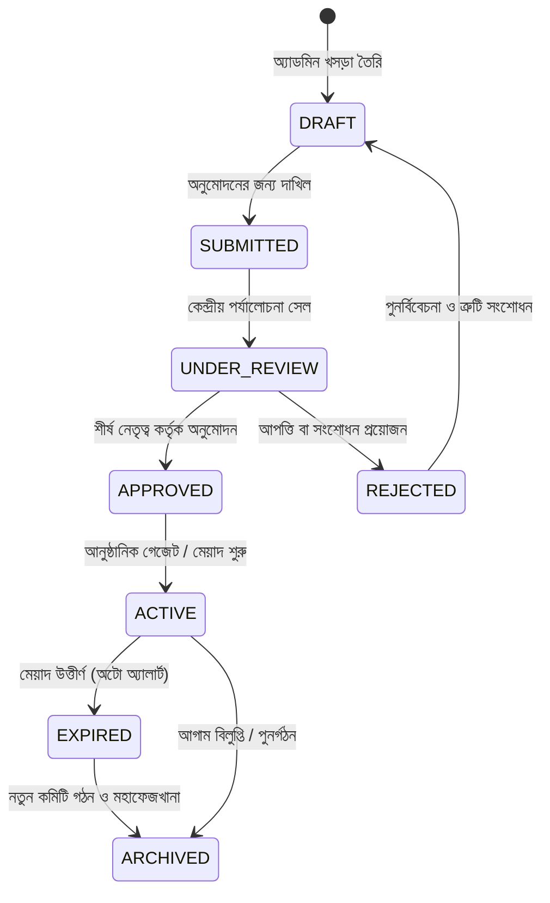

# Committee Management Module (সাংগঠনিক কমিটি ও সুশাসন স্থাপত্য)
## জাতীয়তাবাদী গণতান্ত্রিক যুব আন্দোলন (Youth Movement - NDM)

---

## ১. নির্বাহী রূপরেখা (Executive Vision)

জাতীয়তাবাদী গণতান্ত্রিক যুব আন্দোলন (Youth Movement - NDM)-এর কাঠামোতে **কমিটি (Committee)** নিছক কোনো নামের তালিকা (Member List) নয়; এটি একটি **সাংগঠনিক সুশাসন সত্তা (Organizational Governance Entity)**।

```text
Organization (জাতীয়তাবাদী গণতান্ত্রিক যুব আন্দোলন)
    │
    ├── Geographic Unit (ভৌগোলিক প্রশাসনিক ইউনিট)
    │      ├── Division (বিভাগীয় সেল)
    │      ├── District / Metro (জেলা ও মহানগর শাখা)
    │      ├── Upazila / Thana (উপজেলা / থানা শাখা)
    │      ├── Union / Pourashava (ইউনিয়ন ও পৌরসভা)
    │      └── Ward (তৃণমূল ওয়ার্ড শাখা)
    │
    └── Campus Unit (ক্যাম্পাস ইউনিট)
           ├── Public Universities (ঢাকা বিশ্ববিদ্যালয়, বুয়েট, চবি, রাবি ইত্যাদি)
           ├── Private Universities (বেসরকারি বিশ্ববিদ্যালয় উইং)
           ├── Medical Colleges (মেডিকেল ও ডেন্টাল ইউনিট)
           └── Colleges (সরকারি ও বেসরকারি কলেজ শাখা)
```

---

## ২. কমিটি প্রকারভেদ (Configurable Committee Types)

কমিটির স্তর ও দায়িত্বের পরিধি অনুযায়ী ৯টি সুনির্দিষ্ট ক্যাটাগরি:

| কোড | কমিটির স্তর (Type) | বিবরণ |
| :--- | :--- | :--- |
| `CENTRAL` | কেন্দ্রীয় কার্যনির্বাহী সংসদ | দলের জাতীয় নীতিনির্ধারণী শীর্ষ পরিষদ |
| `DIVISION` | বিভাগীয় সমন্বয় সেল | ৮টি প্রশাসনিক বিভাগের সমন্বয় টিম |
| `DISTRICT` | জেলা / মহানগর কার্যনির্বাহী কমিটি | ৬৪ জেলা ও মহানগর পর্যায়ের পূর্ণাঙ্গ কমিটি |
| `UPAZILA` | উপজেলা / থানা শাখা | তৃণমূল উপজেলা ও থানা পরিষদ |
| `UNION` | ইউনিয়ন / পৌরসভা শাখা | তৃণমূল ইউনিয়ন ও পৌর শাখা |
| `WARD` | ওয়ার্ড ইউনিট কমিটি | গ্রাম ও মহল্লা পর্যায়ের প্রাথমিক সেল |
| `CAMPUS` | বিশ্ববিদ্যালয় ও কলেজ সংসদ | উচ্চশিক্ষা প্রতিষ্ঠানের শিক্ষার্থী নেতৃত্ব |
| `SPECIAL` | বিশেষ টাস্কফোর্স সেল | পলিসি থিংক-ট্যাংক, মিডিয়া, লিগ্যাল এইড |
| `TEMPORARY` | আহ্বায়ক / অ্যাডহক কমিটি | নির্দিষ্ট মেয়াদের প্রস্তুতিমূলক সাংগঠনিক বডি |

---

## ৩. কমিটি লাইফসাইকেল ও অনুমোদন পাইপলাইন (Committee Lifecycle)

একটি কমিটির ঐতিহাসিক রেকর্ড ও অডিট ট্রেইল অক্ষুণ্ণ রাখতে কঠোর স্টেট-মেশিন অনুসরণ করা হয়:



### স্ট্যাটাস নির্দেশিকা:
- `DRAFT`: শাখা সমন্বয়ক কমিটি তালিকা প্রস্তুত করছেন।
- `SUBMITTED`: কেন্দ্রীয় দপ্তরে অনুমোদনের জন্য প্রেরণ করা হয়েছে।
- `UNDER_REVIEW`: কেন্দ্রীয় স্ক্রুটিনি সেল সদস্যদের রাজনৈতিক সততা ও যোগ্যতা যাচাই করছে।
- `APPROVED`: কেন্দ্রীয় সভাপতি ও সাধারণ সম্পাদক কর্তৃক স্বাক্ষরিত ও অনুমোদিত।
- `ACTIVE`: বর্তমান কার্যকর কমিটি হিসেবে মাঠে সাংগঠনিক কার্যক্রম পরিচালনা করছে।
- `EXPIRED`: অনুমোদিত মেয়াদকাল (যেমন ২ বছর বা ৬ মাস) শেষ হয়েছে।
- `REJECTED`: শর্তপূরণ না হওয়ায় সংশোধনের জন্য ফেরত পাঠানো হয়েছে।
- `ARCHIVED`: নতুন কমিটি গঠিত হওয়ায় বা মেয়াদোত্তীর্ণ হওয়ায় ঐতিহাসিক আর্কাইভে সংরক্ষিত (মুছে ফেলা নিষিদ্ধ)।

---

## ৪. ডাইনামিক পদবী ব্যবস্থাপনা (Database-Driven Committee Positions)

পদবী কোনো অবস্থাতেই হার্ড-কোড থাকবে না; ডাটাবেস পরিচালিত হবে এবং প্রতিটি পদের জন্য হায়ারার্কি র্যাঙ্ক (Hierarchy Rank) থাকবে।

### ক. ভৌগোলিক ও সাধারণ কমিটির পদবী সেট:
1. সভাপতি (President) - `Rank: 1`, `Max: 1`
2. সহ-সভাপতি (Vice President) - `Rank: 2`, `Max: 5`
3. সাধারণ সম্পাদক (General Secretary) - `Rank: 3`, `Max: 1`
4. যুগ্ম সাধারণ সম্পাদক (Joint Secretary) - `Rank: 4`, `Max: 3`
5. সাংগঠনিক সম্পাদক (Organizing Secretary) - `Rank: 5`, `Max: 1`
6. সহ-সাংগঠনিক সম্পাদক (Assistant Organizing Secretary) - `Rank: 6`, `Max: 2`
7. অর্থ সম্পাদক (Treasurer) - `Rank: 7`, `Max: 1`
8. দপ্তর সম্পাদক (Office Secretary) - `Rank: 8`, `Max: 1`
9. প্রচার ও প্রকাশনা সম্পাদক (Publicity Secretary) - `Rank: 9`, `Max: 1`
10. তথ্য ও প্রযুক্তি সম্পাদক (IT Secretary) - `Rank: 10`, `Max: 1`
11. সমাজকল্যাণ ও ত্রাণ সম্পাদক (Social Welfare Secretary) - `Rank: 11`, `Max: 1`
12. নির্বাহী সদস্য (Executive Member) - `Rank: 12`, `Max: 21`
13. সাধারণ সদস্য (General Member) - `Rank: 13`, `Max: Unlimited`

### খ. ক্যাম্পাস ও আহ্বায়ক কমিটির পদবী সেট:
1. আহ্বায়ক (Convener) - `Rank: 1`, `Max: 1`
2. যুগ্ম আহ্বায়ক (Joint Convener) - `Rank: 2`, `Max: 7`
3. সদস্য সচিব (Member Secretary) - `Rank: 3`, `Max: 1`
4. যুগ্ম সদস্য সচিব (Joint Member Secretary) - `Rank: 4`, `Max: 3`
5. সদস্য (Member) - `Rank: 5`, `Max: 31`

---

## ৫. সদস্য পদায়ন বনাম সাধারণ সদস্য (Member vs CommitteeMember)

> **গুরুত্বপূর্ণ সুশাসন নীতি**:
> `Member` হলো সংগঠনের একজন নিবন্ধিত ব্যক্তি (User Person)।
> `CommitteeMember` হলো সেই ব্যক্তির একটি নির্দিষ্ট কমিটিতে **নির্দিষ্ট পদে সাময়িক বা আনুষ্ঠানিক নিয়োগ (Assignment)**।

- একই ব্যক্তি একাধিক কমিটিতে দায়িত্ব পেতে পারেন (যেমন: কেন্দ্রীয় নির্বাহী সদস্য + ঢাকা মহানগর সহ-সভাপতি)।
- তবে একই কমিটির একই মেয়াদে দুটি সাংঘর্ষিক পদে এক ব্যক্তি অধিষ্ঠিত হতে পারবেন না (`UniqueConstraint: committeeId + memberId`)।
- প্রতিটি পদায়নে শুরু তারিখ, শেষ তারিখ, নিয়োগের ধরন (`REGULAR`, `CO_OPTED`, `INTERIM`) এবং নোট সংরক্ষিত থাকে।

---

## ৬. কমিটি ইতিহাস ও পরিবর্তন ট্র্যাকিং (History & Change Audit)

কখনো কোনো কমিটি ডাটাবেস থেকে ডিলিট করা হবে না। 
১. **মেয়াদভিত্তিক ইতিহাস**: ঢাকা জেলা শাখার ২০২৪-২০২৬ কমিটি আর্কাইভে থাকবে, ২০২৬-২০২৮ কমিটি অ্যাক্টিভ থাকবে।
২. **অভ্যন্তরীণ পরিবর্তন হিস্ট্রি (Internal Granular Audit)**:
   - কে কোন তারিখে সভাপতি পদ পেয়েছেন।
   - শৃঙ্খলাভঙ্গের কারণে কার পদ প্রত্যাহার করা হয়েছে।
   - শূন্য পদে কাকে কো-অপ্ট করা হয়েছে।
   - প্রতিটি ইভেন্টে `changedBy`, `oldPosition`, `newPosition`, `timestamp` ও `reason` সংরক্ষিত থাকবে।

---

## ৭. অনুমোদন ওয়ার্কফ্লো (Approval Workflow)

অনুমোদনের সময় নিম্নোক্ত ফিল্ডসমূহ অডিট ট্রেইলে যুক্ত হয়:
- `approvedBy`: অনুমোদনকারী কেন্দ্রীয় কর্মকর্তার ইমেইল ও নাম।
- `approvedAt`: অনুমোদনের সঠিক সময় ও তারিখ।
- `approvalNote`: আনুষ্ঠানিক সিদ্ধান্ত বা স্মারক নম্বর।
- `resolutionNo`: ইউনিক ভেরিফায়েবল রেজুলেশন কোড (যেমন: `NDM-Y/COM/2026-081`)।

---

## ৮. এন্টারপ্রাইজ RESTful API স্পেসিফিকেশন

### মূল কমিটি ম্যানেজমেন্ট
- `GET /api/v1/committees`: ফিল্টারসহ সকল কমিটির তালিকা (`type`, `status`, `search`, `division`, `district`).
- `POST /api/v1/committees`: নতুন কমিটি তৈরি (Default: `DRAFT`).
- `GET /api/v1/committees/[id]`: একক কমিটির বিস্তারিত তথ্য, পদায়ন ও ইতিহাস।
- `PATCH /api/v1/committees/[id]`: কমিটির মৌলিক তথ্য হালনাগাদ।
- `DELETE /api/v1/committees/[id]`: ড্রাফট কমিটি মুছে ফেলা (অ্যাক্টিভ হলে নিষিদ্ধ, আর্কাইভ করতে হবে)।

### লাইফসাইকেল অ্যাকশন
- `POST /api/v1/committees/[id]/submit`: পর্যালোচনার জন্য সাবমিট (`DRAFT` $\rightarrow$ `SUBMITTED`).
- `POST /api/v1/committees/[id]/approve`: কমিটি অনুমোদন (`SUBMITTED/UNDER_REVIEW` $\rightarrow$ `APPROVED`).
- `POST /api/v1/committees/[id]/reject`: কমিটি বাতিল বা ফেরত (`REJECTED` $\rightarrow$ `DRAFT`).
- `POST /api/v1/committees/[id]/activate`: কার্যকর ঘোষণা (`APPROVED` $\rightarrow$ `ACTIVE`).
- `POST /api/v1/committees/[id]/archive`: আর্কাইভে স্থানান্তর (`EXPIRED/ACTIVE` $\rightarrow$ `ARCHIVED`).

### কমিটি পদায়ন (Members Assignment)
- `GET /api/v1/committees/[id]/members`: কমিটির সকল কর্মকর্তা ও সদস্য তালিকা।
- `POST /api/v1/committees/[id]/members`: নির্দিষ্ট পদে সদস্য পদায়ন।
- `PATCH /api/v1/committees/[id]/members/[memberId]`: পদবী বা স্ট্যাটাস পরিবর্তন।
- `DELETE /api/v1/committees/[id]/members/[memberId]`: পদায়ন প্রত্যাহার বা অব্যাহতি।

### পদবী কনফিগারেশন (Positions)
- `GET /api/v1/committee-positions`: অনুমোদিত পদবীর তালিকা।
- `POST /api/v1/committee-positions`: নতুন পদবী তৈরি।
- `PATCH /api/v1/committee-positions/[id]`: পদবী ও র্যাঙ্ক সম্পাদনা।
- `DELETE /api/v1/committee-positions/[id]`: অব্যবহৃত পদবী অপসারণ।

### হিস্ট্রি ও অডিট ট্রেইল
- `GET /api/v1/committees/[id]/history`: পূর্বতন মেয়াদের কমিটি ইতিহাস।
- `GET /api/v1/committees/[id]/audit-logs`: কমিটির অভ্যন্তরীণ সকল পরিবর্তনের সময়ানুক্রমিক রেকর্ড।

---

## ৯. মূল বিজনেস রুলস ও কনস্ট্রেইন্ট (Core Business Rules)

1. **সিঙ্গেল অ্যাক্টিভ কমিটি নীতি**: একটি ইউনিটের একই সময়ে কেবল একটিমাত্র `ACTIVE` কমিটি থাকতে পারবে।
2. **সময়সীমা বৈধতা**: অবশ্যই `startDate < endDate` হতে হবে।
3. **আর্কাইভ অপরিবর্তনীয়তা**: `ARCHIVED` কমিটি এডিট বা পরিবর্তনযোগ্য নয়; প্রয়োজনে নতুন কমিটি গঠন করতে হবে।
4. **ডুপ্লিকেট পদায়ন প্রতিরোধ**: একই ব্যক্তি একই কমিটিতে একই সময়ে একাধিক সক্রিয় পদ পাবেন না।
5. **রেজুলেশন স্বাতন্ত্র্য**: প্রতিটি কমিটির ইউনিক রেজুলেশন নম্বর থাকতে হবে।
6. **অনুমোদনের যোগ্যতা**: সভাপতি ও সাধারণ সম্পাদক (বা আহ্বায়ক ও সদস্য সচিব) পদে পদায়ন সম্পন্ন না করে কমিটি `ACTIVE` করা যাবে না।
7. **স্বয়ংক্রিয় অডিট ট্রেইল**: প্রতিটি পদায়ন, পরিবর্তন বা লাইফসাইকেল ট্রানজিশন অপরিবর্তনীয় অডিট লগে সেভ হবে।

---
*ডকুমেন্ট সংস্করণ: ২.০ (এন্টারপ্রাইজ রিলিজ)*  
*প্রস্তুতকারক: জাতীয়তাবাদী গণতান্ত্রিক যুব আন্দোলন - আইটি ও নীতি গভর্ন্যান্স সেল*
