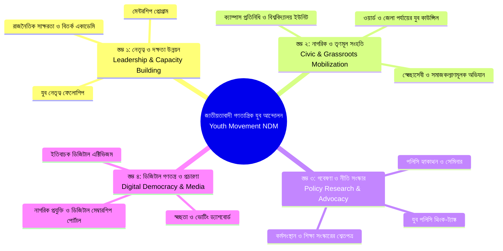

# জাতীয়তাবাদী গণতান্ত্রিক যুব আন্দোলন
## Youth Movement – National Democratic Movement (NDM)
### কৌশলগত রূপরেখা ও ধারণাপত্র (Strategic Blueprint & Concept Paper)

---

## ১. নির্বাহী সারসংক্ষেপ (Executive Summary)

**জাতীয়তাবাদী গণতান্ত্রিক যুব আন্দোলন (Youth Movement – NDM)** হলো একটি সুসংগঠিত নাগরিক ও রাজনৈতিক যুব উদ্যোগ, যার লক্ষ্য নতুন প্রজন্মের তরুণদের গণতান্ত্রিক মূল্যবোধ, নাগরিক সচেতনতা, নীতিজ্ঞান এবং নেতৃত্বের দক্ষতায় সমৃদ্ধ করা।

বাংলাদেশের আর্থ-সামাজিক ও রাজনৈতিক পরিবর্তনের প্রধান শক্তি হলো তরুণ প্রজন্ম। তৃণমূলের তরুণদের আশা-আকাঙ্ক্ষা এবং জাতীয় নীতি-নির্ধারণের মধ্যকার দূরত্ব দূর করতে এই আন্দোলন একটি শক্তিশালী সেতু হিসেবে কাজ করবে।

The **Youth Movement – NDM** is an organized civic and political youth initiative dedicated to empowering the next generation of youth with democratic values, civic consciousness, policy literacy, and active leadership skills to build an ethical and self-reliant nation.

---

## ২. ভিশন ও মিশন (Vision & Mission)

```
+-----------------------------------------------------------------------------------+
|                                  ভিশন / VISION                                    |
|   একটি গতিশীল, সমৃদ্ধ ও অন্তর্ভুক্তিমূলক সমাজ—যেখানে সচেতন তরুণ নেতৃত্ব নৈতিক      |
|           সুশাসন, সামাজিক সুবিচার এবং জাতীয় অগ্রগতি নিশ্চিত করবে।                 |
|                                                                                   |
|  A dynamic, democratic, and inclusive society where empowered youth lead ethical  |
|         governance, social justice, and sustainable national progress.             |
+-----------------------------------------------------------------------------------+
                                         |
                                         v
+-----------------------------------------------------------------------------------+
|                                  মিশন / MISSION                                    |
|   ক্যাম্পাস, কর্মক্ষেত্র এবং তৃণমূলের প্রতিটি প্রান্তের তরুণদের উদ্বুদ্ধ, শিক্ষিত   |
|   ও দক্ষ করে গড়ে তোলা—যাতে তারা গণতান্ত্রিক রূপান্তর ও দেশ বিনির্মাণে নেতৃত্ব দিতে পারে।|
|                                                                                   |
|  To mobilize, educate, and equip young citizens across campuses, communities,     |
|   and professions with the tools, skills, and ethical foundation to drive         |
|   positive democratic transformation and national development.                    |
+-----------------------------------------------------------------------------------+
```

### যুব আন্দোলনের মূল স্লোগান ও মূলমন্ত্র (Motto)

```
=====================================================================================
                      কর্ম  -----  সততা  -----  সমৃদ্ধি
               ( Action / Work  —  Integrity  —  Prosperity )
=====================================================================================
```

> **অফিশিয়াল ফেসবুক পেজ**: [facebook.com/ndmyouth](https://www.facebook.com/ndmyouth/)

### সংগঠনের মূলনীতি (Core Principles)

সংগঠনের যাবতীয় কর্মকাণ্ড ও রাজনৈতিক আদর্শ নিচের ৪টি মৌলিক ভিত্তির ওপর প্রতিষ্ঠিত:

```
+-----------------------------------------------------------------------------------+
|                        সংগঠনের ৪টি মৌলিক নীতি (Core Principles)                    |
+-----------------------------------------------------------------------------------+
|  ১. জবাবদিহিতামূলক গণতন্ত্র (Accountable Democracy)                                 |
|     - রাষ্ট্র ও সংগঠনের প্রতিটি স্তরে পূর্ণ জবাবদিহিতা, স্বচ্ছতা ও ভোটাধিকার নিশ্চিত।   |
|                                                                                   |
|  ২. বাংলাদেশী জাতীয়তাবাদ (Bangladeshi Nationalism)                                  |
|     - সকল ধর্ম-বর্ণ-গোষ্ঠীর সম্মিলনে সার্বভৌম, আত্মমর্যাদাশীল ও ঐক্যবদ্ধ বাংলাদেশ।      |
|                                                                                   |
|  ৩. ধর্মীয় মূল্যবোধ (Religious & Moral Values)                                     |
|     - সকল ধর্মের প্রতি শ্রদ্ধা, সাম্প্রদায়িক সম্প্রীতি এবং নৈতিক ও মানবিক আদর্শের চর্চা।  |
|                                                                                   |
|  ৪. সর্বজনীন সামাজিক সুরক্ষা (Universal Social Security)                          |
|     - প্রতিটি নাগরিকের অন্ন, বস্ত্র, বাসস্থান, শিক্ষা, স্বাস্থ্য ও মর্যাদাপূর্ণ জীবনের নিশ্চয়তা।|
+-----------------------------------------------------------------------------------+
```

---

## ৩. কৌশলগত স্তম্ভসমূহ (Strategic Pillars)



### বিস্তারিত স্তম্ভসমূহ (Pillar Details)

1. **স্তম্ভ ১: নেতৃত্ব ও সক্ষমতা বৃদ্ধি (Leadership & Capacity Building)**
   - **ফিউচার লিডার্স একাডেমি (Future Leaders Academy)**: সংবিধান, সুশাসন, প্রজেক্ট ম্যানেজমেন্ট এবং পাবলিক স্পিকিং-এর ওপর সার্টিফিকেট প্রশিক্ষণ।
   - **যুব বিতর্ক ও ছায়া সংসদ (Debate & Model Parliament)**: তরুণদের নীতিগত যুক্তিতর্ক ও আইন প্রণয়নের ধারণা বিকাশে জাতীয় যুব সংসদ আয়োজন।

2. **স্তম্ভ ২: তৃণমূল ও ক্যাম্পাস নেটওয়ার্ক (Civic & Grassroots Mobilization)**
   - **ক্যাম্পাস অ্যাম্বাসেডর (Campus Ambassadors)**: বিশ্ববিদ্যালয়, কলেজ ও পলিটেকনিক ইনস্টিটিউটে তরুণদের নেতৃত্ব প্রতিষ্ঠা।
   - **কমিউনিটি সোশ্যাল অ্যাকশন**: বৃক্ষরোপণ, স্বেচ্ছায় রক্তদান, দুর্যোগে ত্রাণ সহায়তা ও সাক্ষরতা কর্মসূচি।

3. **স্তম্ভ ৩: নীতি গবেষণা ও সংস্কার প্রস্তাব (Policy Research & Advocacy)**
   - **যুব ইশতেহার ও শ্বেতপত্র প্রণয়ন**: শিক্ষা সংস্কার, যুব কর্মসংস্থান, উদ্যোক্তা সহায়তা এবং তরুণদের স্বাস্থ্যসেবা নিশ্চিতকরণে কার্যকর পলিসি তৈরি ও সরকারের নিকট উপস্থাপন।

4. **স্তম্ভ ৪: ডিজিটাল এক্টিভিজম ও গণতন্ত্র (Digital Democracy & Innovation)**
   - ডিজিটাল ভোটিং, অনলাইন মতামত জরিপ, ডিজিটাল আইডি ভেরিফিকেশন এবং গুজববিরোধী সচেতনতামূলক তথ্য প্রচার।

---

## ৪. মূল দল (NDM)-এর সাথে আদর্শিক ও সাংগঠনিক সংযোগ (Relationship with NDM)

- **জাতীয়তাবাদী গণতান্ত্রিক আন্দোলন (NDM)**-এর ঘোষিত মৌলিক চার স্তম্ভ: **সার্বভৌমত্ব, গণতন্ত্র, সুশাসন এবং সমৃদ্ধি**।
- **অফিশিয়াল নির্বাচনী প্রতীক ও লোগো**: সিংহ (The Lion) — যা সাহস, নির্ভীকতা, ন্যায়পরায়ণতা ও নেতৃত্বের প্রতীক। গাঢ় সবুজ ও লাল ডোরাকাটা নকশা জাতীয় চেতনা ও তারুণ্যের বিপ্লবের বহিঃপ্রকাশ।
- যুব আন্দোলন হলো NDM-এর তরুণ চালিকাশক্তি ও বিকল্প ধারার প্রগতিশীল নেতৃত্ব তৈরির প্রধান পাঠশালা।
- এটি দলীয় সংকীর্ণতার ঊর্ধ্বে উঠে তরুণদের মাঝে সুস্থ রাজনৈতিক সংস্কৃতি, দেশপ্রেম এবং মেধাভিত্তিক নেতৃত্ব বিকাশে কাজ করে।


---

## ৫. অংশীজন ও লক্ষ্যগোষ্ঠী (Target Demographics)

| শ্রেণি (Segment) | বয়স (Age) | প্রধান অগ্রাধিকার (Focus Areas) | কার্যক্রম কৌশল (Engagement Strategy) |
| :--- | :--- | :--- | :--- |
| **বিশ্ববিদ্যালয় ও কলেজ শিক্ষার্থী** | ১৮ – ২৪ | ক্যাম্পাস নেতৃত্ব, ক্যারিয়ার ও স্কিল ডেভেলপমেন্ট, মুক্ত আলোচনা | ক্যাম্পাস অ্যাম্বাসেডর প্রোগ্রাম, বিতর্ক প্রতিযোগিতা, ওয়ার্কশপ |
| **তরুণ পেশাজীবী ও উদ্যোক্তা** | ২২ – ৩৫ | পলিসি ইনপুট, নেটওয়ার্কিং, সুশাসন সংস্কার, অর্থনৈতিক উদ্ভাবন | পলিসি সার্কেল, গোলটেবিল বৈঠক, পেশাজীবী মিটআপ |
| **তৃণমূল ও গ্রামীণ তরুণ** | ১৬ – ৩০ | কারিগরি দক্ষতা, স্থানীয় উন্নয়ন, যুব ক্লাবের মাধ্যমে অংশগ্রহণ | যুব কাউন্সিল, সমাজসেবা স্কোয়াড, স্থানীয় মতবিনিময় সমাবেশ |
| **প্রবাসী তরুণ প্রজন্ম (Diaspora)** | ১৮ – ৩৫ | বৈশ্বিক অভিজ্ঞতা বিনিময়, আন্তর্জাতিক অ্যাডভোকেসি ও বিনিয়োগ | ভার্চুয়াল চ্যাপ্টার, ওয়েবিনার, আন্তর্জাতিক পলিসি ফেলোশিপ |

---

## ৬. মূল ফ্ল্যাগশিপ কার্যক্রম (Flagship Initiatives)

1. **"তরুণের কণ্ঠস্বর" জাতীয় গোলটেবিল (Youth Voice Townhalls)**
   - নীতিনির্ধারক, নাগরিক সমাজের প্রতিনিধি এবং তরুণদের মধ্যে সরাসরি উন্মুক্ত সংলাপ।
2. **যুব নেতৃত্ব ইনকিউবেটর (Youth Leadership Incubator)**
   - তৃণমূল থেকে উঠে আসা সম্ভাবনাময় তরুণ সংগঠকদের জন্য ৮ সপ্তাহের বিশেষায়িত নেতৃত্ব প্রশিক্ষণ।
3. **জাতীয় যুব মহাসমাবেশ ও পলিসি সম্মেলন (National Youth Congress)**
   - প্রতি বছর দেশের সেরা যুব উদ্ভাবক ও সমাজসেবীদের স্বীকৃতি প্রদান এবং বার্ষিক নীতি প্রস্তাবনা ঘোষণা।
4. **সবুজ বাংলাদেশ অভিযান (Green Vanguard Climate Action)**
   - জলবায়ু পরিবর্তন মোকাবিলায় দেশব্যাপী তরুণদের নেতৃত্বে বৃক্ষরোপণ ও পরিবেশ দূষণবিরোধী সামাজিক আন্দোলন।

---

## ৭. সাফল্যের মানদণ্ড ও সূচক (KPIs)

- **সদস্য সংখ্যা ও বিস্তার**: প্রথম ১২ মাসের মধ্যে দেশের ৬৪ জেলা ও প্রধান বিশ্ববিদ্যালয়গুলোতে সক্রিয় চ্যাপ্টার গঠন।
- **নারীর অংশগ্রহণ**: সংগঠনে ন্যূনতম ৪০% তরুণী ও নারীর প্রতিনিধিত্ব নিশ্চিত করা।
- **প্রশিক্ষণ ও মানবসম্পদ**: বছরে অন্তত ১০,০০০ তরুণকে নাগরিক দায়িত্ব ও নেতৃত্বের প্রাথমিক প্রশিক্ষণ সম্পন্ন করানো।
- **পলিসি আউটপুট**: যুব কর্মসংস্থান ও শিক্ষা বিষয়ক অন্তত ৪টি জাতীয় নীতি গবেষণাপত্র ও সুপারিশ প্রকাশ।
